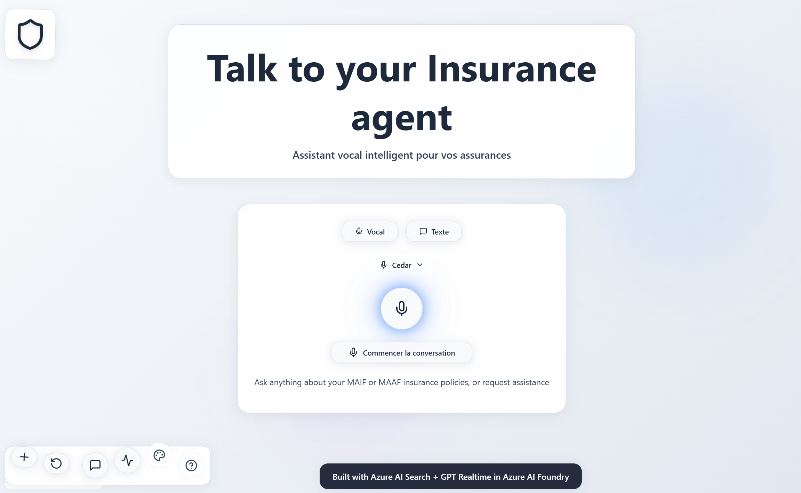
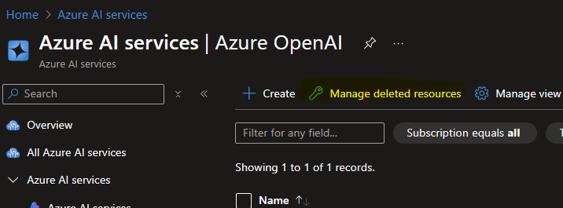
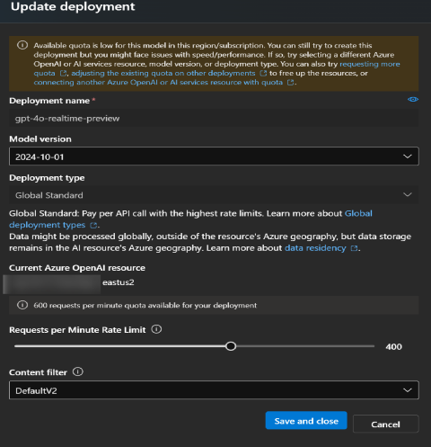

# VoiceRAG: An Application Pattern for RAG + Voice Using Azure AI Search and the GPT Realtime API for Audio



[](https://github.com/codespaces/new?hide_repo_select=true&ref=main&skip_quickstart=true&machine=basicLinux32gb&repo=860141324&devcontainer_path=.devcontainer%2Fdevcontainer.json&geo=WestUs2)
[](https://vscode.dev/redirect?url=vscode://ms-vscode-remote.remote-containers/cloneInVolume?url=https://github.com/Azure-Samples/aisearch-openai-rag-audio)

This repository contains an enhanced **hybrid implementation** of RAG (Retrieval Augmented Generation) supporting both **voice and text interactions**, powered by the **GPT Realtime API** for voice and **GPT-Audio** for text-to-speech. We describe the pattern in more detail in [this blog post](https://aka.ms/voicerag), and you can see this sample app in action in [this short video](https://youtu.be/vXJka8xZ9Ko).

* [Features](#features)
* [Interaction Modes](#interaction-modes)
* [Architecture Diagram](#architecture-diagram)  
* [Getting Started](#getting-started)
  * [GitHub Codespaces](#github-codespaces)
  * [VS Code Dev Containers](#vs-code-dev-containers)
  * [Local environment](#local-environment)
* [Deploying the app](#deploying-the-app)
* [Development server](#development-server)
* [Voice Configuration](#voice-configuration)
* [Configuration](#configuration)

This demo is customized as an **insurance customer assistant for Groupama**. The assistant provides comprehensive support for policy inquiries, claims processing, agency information, and contact details through both **natural voice interface** and **text input with audio responses**.

## Latest updates (UI + UX)

* **Guide-style Help modal**: A left navigation + right content layout (Overview / Question types / APIs / Features).
* **One-click copy prompts**: Copy example questions directly from the Help modal.
* **Improved modal behavior**: Scrollable content with sticky header/footer, plus ESC and overlay-click to close.
* **i18n consistency**: Help/Telemetry/Transcript/Tech UI strings are unified across locales (EN/FR/ES/DE/JA).
* **Theme readability**: Help modal styling is readable across all available themes (`glass`, `white`, `black`).

**Key Data Sources:**

* **API Data**: Policy and claims information (see `app/api/data/load_data.py`)
* **Knowledge Base**: French FAQ data embedded in Azure AI Search (see `data/faq.json`)
* **Real-time APIs**: Multiple endpoints for policies, claims, agencies, and contact information

**Core Components:**

* **Backend**: Voice processing and AI orchestration (`app/backend/app.py`)
* **API Service**: RESTful endpoints for insurance data (`app/api/main.py`)
* **RAG Tools**: Integration with Azure AI Search and custom tools (`app/backend/ragtools.py`)
* **Telemetry**: Performance monitoring and usage analytics (`app/backend/telemetry.py`)

## Features

* **🎤 Dual Interaction Modes**: Choose between voice-first conversations or text input with audio responses
* **🔊 Voice Customization**: Select from 8 AI voice personalities (alloy, ash, coral, echo, fable, nova, sage, shimmer)
* **🎯 Voice interface**: Browser microphone capture processed by Azure OpenAI GPT Realtime API for natural conversations
* **⌨️ Text interface**: Type questions and receive audio responses generated by GPT-Audio API
* **🔍 RAG (Retrieval Augmented Generation)**: Azure AI Search integration for accurate insurance knowledge base queries
* **🔊 Audio output**: High-quality audio responses using Azure OpenAI's latest audio models
* **📋 Citations**: Visual display of search results used to generate responses
* **🏢 Insurance APIs**: Comprehensive REST APIs for:
  - Policy management and inquiries with call history
  - Claims processing and tracking with agent notes
  - Agency and agent information
  - Real-time contact information
  - Customer service support with conversation context
* **🌍 Multi-language Support**: French content with multilingual interface (English, French, German, Spanish, Japanese)
* **🧭 Built-in user guide**: Help modal with grouped question examples, available APIs, and demo overview
* **🎨 Themes**: Switch between `glass`, `white`, and `black` themes (saved in localStorage)
* **📊 Telemetry & Monitoring**: Real-time performance tracking and usage analytics
* **⚙️ Configuration Verification**: Built-in tools to validate Azure OpenAI setup

## Interaction Modes

### 🎤 **Voice Chat Mode (Realtime API)**
- **Technology**: Azure OpenAI Realtime API (WebSocket)
- **Best for**: Natural conversations, interruptions, real-time back-and-forth
- **Features**:
  - Real-time voice processing with server VAD (Voice Activity Detection)
  - Natural conversation flow with turn-taking
  - Interruption handling
  - Live audio streaming
  - Low-latency responses

### ⌨️ **Text Chat Mode (GPT-Audio API)**  
- **Technology**: GPT-Audio API (HTTP)
- **Best for**: Precise questions, complex queries, accessibility
- **Features**:
  - Text input with audio response generation
  - Higher text processing quality
  - More cost-effective for text-based interactions
  - Better for complex reasoning and structured queries
  - Accessibility-friendly interface

### 🔄 **Hybrid Benefits**
Both modes provide:
- **Same RAG capabilities**: Access to full insurance knowledge base
- **Same voice options**: 8 selectable AI voice personalities
- **Same tools**: Policy lookup, claims processing, agency search
- **Same grounding**: Visual citation display and source references
- **Seamless switching**: Change modes during the same session
- **Call history integration**: Access to customer interaction history

### 🎵 **Voice Selection**
Choose from 8 distinct AI voice personalities:
- **alloy**: Neutral, balanced voice
- **ash**: Warm, friendly voice  
- **coral**: Bright, energetic voice
- **echo**: Clear, professional voice
- **fable**: Storytelling, expressive voice
- **nova**: Modern, crisp voice
- **sage**: Wise, calm voice
- **shimmer**: Light, pleasant voice

Voice preferences are saved automatically and apply to both interaction modes.

### Architecture Diagram

The application supports **dual interaction patterns**:

1. **Voice Mode**: `RTClient` captures audio → `RTMiddleTier` → Azure OpenAI Realtime API (WebSocket)
2. **Text Mode**: Text input → `ChatHandler` → GPT-Audio API (HTTP) → Audio response


**Updated Architecture Components:**
- **Frontend**: React-based interface with voice/text modes and voice selection
- **Backend Service** (`app/backend/`): Hybrid processing supporting both Realtime and GPT-Audio APIs
- **API Service** (`app/api/`): Insurance data endpoints with call history integration
- **Telemetry System**: OpenTelemetry monitoring for both interaction modes
- **Configuration Tools**: Built-in verification and voice preference management

This repository includes infrastructure as code and `Dockerfile` configurations to deploy the app to Azure Container Apps with separate containers for backend and API services, supporting both voice and text interaction patterns.

## Getting Started

You have a few options for getting started with this template. The quickest way to get started is [GitHub Codespaces](#github-codespaces), since it will setup all the tools for you, but you can also [set it up locally](#local-environment). You can also use a [VS Code dev container](#vs-code-dev-containers)

### GitHub Codespaces

You can run this repo virtually by using GitHub Codespaces, which will open a web-based VS Code in your browser:

[](https://github.com/codespaces/new?hide_repo_select=true&ref=main&skip_quickstart=true&machine=basicLinux32gb&repo=860141324&devcontainer_path=.devcontainer%2Fdevcontainer.json&geo=WestUs2)

Once the codespace opens (this may take several minutes), open a new terminal and proceed to [deploy the app](#deploying-the-app).

### VS Code Dev Containers

You can run the project in your local VS Code Dev Container using the [Dev Containers extension](https://marketplace.visualstudio.com/items?itemName=ms-vscode-remote.remote-containers):

1. Start Docker Desktop (install it if not already installed)
2. Open the project:

    [](https://vscode.dev/redirect?url=vscode://ms-vscode-remote.remote-containers/cloneInVolume?url=https://github.com/azure-samples/aisearch-openai-rag-audio)
3. In the VS Code window that opens, once the project files show up (this may take several minutes), open a new terminal, and proceed to [deploying the app](#deploying-the-app).

### Local environment

1. Install the required tools:
   * [Azure Developer CLI](https://aka.ms/azure-dev/install)
   * [Node.js](https://nodejs.org/)
   * [NPM](https://www.npmjs.com/)
   * [Docker](https://www.docker.com/products/docker-desktop)
   * [Dev tools C++](https://visualstudio.microsoft.com/visual-cpp-build-tools/)
   * [Python >=3.11](https://www.python.org/downloads/)
      * **Important**: Python and the pip package manager must be in the path in Windows for the setup scripts to work.
      * **Important**: Ensure you can run `python --version` from console. On Ubuntu, you might need to run `sudo apt install python-is-python3` to link `python` to `python3`.
   * [Git](https://git-scm.com/downloads)
   * [Powershell](https://learn.microsoft.com/powershell/scripting/install/installing-powershell) - For Windows users only.

2. Clone the repo (`git clone https://github.com/olivMertens/gpt4oaudioVoiceRagApis.git`)
3. Proceed to the next section to [deploy the app](#deploying-the-app).

## Deploying the app

The steps below will provision Azure resources and deploy the **hybrid voice/text application** to Azure Container Apps.

1. Login to your Azure account:

    ```shell
    azd auth login
    ```

    For GitHub Codespaces users, if the previous command fails, try:

   ```shell
    azd auth login --use-device-code
    ```

1. Create a new azd environment:

    ```shell
    azd env new
    ```

    Enter a name that will be used for the resource group.
    This will create a new folder in the `.azure` folder, and set it as the active environment for any calls to `azd` going forward.

1. This is the point where you can customize the deployment by setting azd environment variables, in order to [use existing services](docs/existing_services.md) or [customize the voice choice](docs/customizing_deploy.md). For additional setup options and real-time features, see [SETUP.md](SETUP.md).

1. Run this command to ensure that the [infrastructure](../infra/main.bicep) does not make a brand new OpenAI service:

    ```bash
    azd env set AZURE_OPENAI_REUSE_EXISTING true
    ```

2. Run this command to ensure that the [infrastructure](../infra/main.bicep) assigns the proper RBAC roles for accessing the OpenAI resource:

    ```bash
    azd env set AZURE_OPENAI_RESOURCE_GROUP yourresourcegroupname
    ```

3. Run this command to point the app code at your Azure OpenAI endpoint:

    ```bash
    azd env set AZURE_OPENAI_ENDPOINT https://cog-fbgwp5e2xzeezxwoo.openai.azure.com
    ```

4. Configure the Azure OpenAI deployments for both interaction modes:

    ```bash
    # Realtime API for voice interactions
    azd env set AZURE_OPENAI_REALTIME_DEPLOYMENT gpt-realtime
    azd env set AZURE_OPENAI_REALTIME_API_VERSION 2025-04-01-preview
    
    # GPT-Audio for text-to-speech
    azd env set AZURE_OPENAI_AUDIO_DEPLOYMENT gpt-audio
    azd env set AZURE_OPENAI_API_VERSION 2025-01-01-preview
    
    # Embedding model for RAG
    azd env set AZURE_OPENAI_EMBEDDING_MODEL text-embedding-3-large
    
    # Default voice (can be changed in UI)
    azd env set AZURE_OPENAI_REALTIME_VOICE_CHOICE alloy
    ```


5. Run this single command to provision the resources, deploy the code, and setup integrated vectorization for the sample data:

   ```shell
   azd up
   ````
   * **Important**: Beware that the resources created by this command will incur immediate costs, primarily from the AI Search resource. These resources may accrue costs even if you interrupt the command before it is fully executed. You can run `azd down` or delete the resources manually to avoid unnecessary spending.
   The delete could be long enough to delete the resources, so be patient.
   * **Important**: When deleting model deployments, they are moved to soft delete and stay in the subscription for 30 days. You can delete them permanently in the Azure portal in your Azure OpenAI resource. This is important because there are limits on the number of deployments and you can't create a new one if you reach the limit.
   Instead you could use the hard reset command `azd down --purge`

   
   * You will be prompted to select two locations, one for the majority of resources and one for the OpenAI resource. The GPT real-time models are available for global deployments in East US 2 and Sweden Central regions only. For the most up-to-date information about quota and region availability, check the [Azure OpenAI Real-time documentation](https://learn.microsoft.com/en-us/azure/ai-foundry/openai/how-to/realtime-audio)
   * You can also update the quota for the model directly in Microsoft Foundry, in the Deployment section
   

6. After the application has been successfully deployed you will see a URL printed to the console. Navigate to that URL to interact with the app in your browser. 

   **Two URLs will be provided:**
   - **API Service**: Test the API endpoints (add `/health` to check if the API is running)
   - **Main Application**: The hybrid voice/text insurance assistant interface
   
   **Testing Both Modes:**
   
   **Voice Chat Mode:**
   - Click "Voice Chat (Realtime)" tab
   - Click "Start conversation" button, say "Hello"
   - Ask questions like: "What types of insurance does Groupama offer?"

   **Text Chat Mode:**
   - Click "Text Chat (GPT-Audio)" tab
   - Type your question in the text field
   - Receive both text and audio responses
   
   **Voice Customization:**
   - Click the voice selector (🔊) to choose from 8 AI voices
   - Voice changes apply to both interaction modes
   - Try questions like:
      - "How do I file a claim with Groupama?"
       - "Find me a Groupama agency in Lyon"
      - "What's the contact number for Groupama customer service?"

You can also now run the app locally by following the instructions in [the next section](#development-server).

## Development local server

You can run this app locally using either the Azure services you provisioned by following the [deployment instructions](#deploying-the-app), or by pointing the local app at already [existing services](docs/existing_services.md).

### Prerequisites

Before running locally, you can verify your Azure OpenAI configuration using the included verification script:

```shell
python verify_config.py
```

This script validates:
- Endpoint format and connectivity
- API version compatibility
- Deployment name validation
- Model compatibility
- Environment variable setup
- WebSocket connection testing

### Environment Configuration

1. If you deployed with `azd up`, you should see a `app/backend/.env` file with the necessary environment variables.

2. If you did *not* use `azd up`, create `.env` file in the project root with the following environment variables:

   ```shell
   # Azure OpenAI Configuration for GPT Realtime (Voice)
   AZURE_OPENAI_ENDPOINT=https://<your-instance>.openai.azure.com
   AZURE_OPENAI_API_KEY=<your-api-key>
   AZURE_OPENAI_REALTIME_DEPLOYMENT=gpt-realtime
   AZURE_OPENAI_REALTIME_API_VERSION=2025-04-01-preview
   AZURE_OPENAI_REALTIME_VOICE_CHOICE=alloy  # Options: alloy, ash, coral, echo, fable, nova, sage, shimmer
   AZURE_OPENAI_REALTIME_TRANSCRIPTION_LANGUAGE=fr  # fr for French, en for English

   # Azure OpenAI Configuration for GPT-Audio (Text-to-Speech)
   AZURE_OPENAI_AUDIO_ENDPOINT=https://<your-instance>.openai.azure.com
   AZURE_OPENAI_AUDIO_API_KEY=<your-api-key>
   AZURE_OPENAI_AUDIO_DEPLOYMENT=gpt-audio
   AZURE_OPENAI_AUDIO_API_VERSION=2025-01-01-preview
   AZURE_OPENAI_AUDIO_VOICE_CHOICE=alloy

   # Azure Search Configuration (for RAG)
   AZURE_OPENAI_EMBEDDING_DEPLOYMENT=text-embedding-3-large
   AZURE_SEARCH_ENDPOINT=https://<your-service>.search.windows.net
   AZURE_SEARCH_API_KEY=<your-search-api-key>
   AZURE_SEARCH_INDEX=voicerag-intvect
   AZURE_SEARCH_SEMANTIC_CONFIGURATION=default
   AZURE_SEARCH_IDENTIFIER_FIELD=chunk_id
   AZURE_SEARCH_CONTENT_FIELD=chunk
   AZURE_SEARCH_EMBEDDING_FIELD=text_vector
   AZURE_SEARCH_TITLE_FIELD=title
   AZURE_SEARCH_USE_VECTOR_QUERY=true

   # Application Configuration
   RUNNING_IN_PRODUCTION=false

   # Optional: Azure Authentication (if not using API keys)
   # AZURE_TENANT_ID=<your-tenant-id>
   ```

   **To use Entra ID** (your user when running locally, managed identity when deployed) simply don't set the `AZURE_OPENAI_API_KEY` and `AZURE_SEARCH_API_KEY`.

### Installation & Setup

3. Create and activate a Python virtual environment:

   **Option A - Using venv (Standard Python):**
   ```shell
   # Create virtual environment
   python -m venv .venv
   
   # Activate virtual environment
   # Windows:
   .\.venv\Scripts\Activate.ps1
   # Linux/Mac:
   source .venv/bin/activate
   ```

   **Option B - Using uv (Faster, Recommended):**
   ```shell
   # Install uv if not already installed
   pip install uv
   
   # Create and activate virtual environment
   uv venv .venv
   
   # Activate virtual environment
   # Windows:
   .\.venv\Scripts\Activate.ps1
   # Linux/Mac:
   source .venv/bin/activate
   ```

4. Install the required dependencies for both API and backend services:

   **Using pip:**
   ```shell
   # Install backend requirements
   cd app/backend
   pip install -r requirements.txt
   
   # Install API requirements
   cd ../api
   pip install -r requirements.txt
   ```

   **Using uv (Faster):**
   ```shell
   # Install backend and API requirements
   uv pip install -r app/backend/requirements.txt
   uv pip install -r app/api/requirements.txt
   ```

5. (Optional) If you need to re-initialize the Azure AI Search index with the insurance FAQ data:

   ```shell
   cd app/backend
   python setup_intvect.py
   ```

### Running the Application

6. Start the application using the provided scripts:

   **Windows (PowerShell):**
   ```pwsh
   pwsh .\scripts\start.ps1
   ```

   **Linux/Mac:**
   ```bash
   ./scripts/start.sh
   ```

   **Alternative - Use VS Code Task:**
   - Open VS Code Command Palette (`Ctrl+Shift+P` or `Cmd+Shift+P`)
   - Run task: "Start app"

### Verification

7. Verify the services are running:
   - **Backend Health**: [http://localhost:8000](http://localhost:8000)
   - **API Health**: [http://localhost:8765/health](http://localhost:8765/health)

   The API should return: `Groupama Insurance Voice Assistant API`

8. **Testing the Application**:
   Navigate to [http://localhost:8000](http://localhost:8000) to see the hybrid insurance assistant interface.

   **Voice Chat Mode (Realtime API):**
   - Click the "Voice Chat (Realtime)" tab  
   - Click the "Start conversation" button
   - Say "Hello" to initialize
   - Ask insurance-related questions like:
       - "Quels sont les produits d'assurance de Groupama?" (What insurance products does Groupama offer?)
       - "Comment contacter le service client Groupama?" (How to contact Groupama customer service?)
       - "Parlez-moi des polices d'assurance automobile Groupama" (Tell me about Groupama's auto policies)

   **Text Chat Mode (GPT-Audio):**
   - Click the "Text Chat (GPT-Audio)" tab
   - Type your question in the text field
   - Receive both text response and audio output
   - Use the voice selector (🔊) to change between 8 AI voices

   **Features to Try:**
   - Click the Help button (?) for demo guide with real example questions
   - Use the voice selector to switch between different AI personalities
   - Toggle between voice and text modes seamlessly
   - View grounding information showing which FAQ sources were used

## Voice Configuration

The application supports 8 distinct AI voice personalities that can be selected through the UI:

```bash
# Set default voice (users can override in UI)
azd env set AZURE_OPENAI_REALTIME_VOICE_CHOICE alloy

# Available voices: alloy, ash, coral, echo, fable, nova, sage, shimmer
```

**Voice Characteristics:**
- **alloy**: Neutral, balanced - good for professional interactions
- **ash**: Warm, friendly - ideal for customer service
- **coral**: Bright, energetic - engaging for marketing content  
- **echo**: Clear, professional - perfect for technical explanations
- **fable**: Storytelling, expressive - great for educational content
- **nova**: Modern, crisp - contemporary business voice
- **sage**: Wise, calm - authoritative knowledge sharing
- **shimmer**: Light, pleasant - welcoming customer interactions

### Voice Selection in UI

Users can change their voice preference through the application interface:

1. **Voice Selector Button**: Click the 🔊 button in the interface
2. **Voice Selection Panel**: Choose from 8 available voice personalities
3. **Real-time Updates**: Voice changes apply immediately to both modes
4. **Automatic Saving**: Preferences are saved in browser local storage

**Technical Implementation:**
- Voice changes update both Realtime API and GPT-Audio configurations
- Backend endpoint `/api/voice-settings` handles dynamic voice updates
- RTMiddleTier and ChatHandler both support voice_choice property
- Environment variables provide default values, UI overrides for sessions

## Configuration

### Data Customization

The application uses French insurance data and can be customized for different industries or regions:

**Primary Data Sources:**
- **`data/faq.json`**: French FAQ content for the Groupama demo, embedded into Azure AI Search
- **`app/api/data/load_data.py`**: Policy and claims data for API endpoints
- **`app/backend/app.py`**: System prompt configuration and language settings
- **`app/backend/ragtools.py`**: Custom tools for insurance APIs and Azure AI Search integration

**Language Configuration:**
- The knowledge base is primarily in French (`data/faq.json`)
- The assistant supports multilingual interfaces (English, French, German, Spanish, Japanese)
- Located in `app/frontend/src/locales/`

**API Endpoints Enhanced:**
- `/api/policies` - Policy information with call history integration
- `/api/claims` - Claims processing with agent interaction logs
- `/api/agencies` - Agency information with contact preferences
- `/api/contact` - Contact information with preferred communication modes
- `/api/voice-settings` - Voice preference management (POST)
- `/api/chat` - Text-based chat with GPT-Audio support

### Advanced Configuration

For additional configuration options, including real-time features and API integrations, see:
- **[SETUP.md](SETUP.md)** - Detailed setup instructions for advanced features
- **[docs/existing_services.md](docs/existing_services.md)** - Using existing Azure services
- **[docs/customizing_deploy.md](docs/customizing_deploy.md)** - Customization options

## Guidance

### Costs

The hybrid application uses two Azure OpenAI models which affects pricing:

* **Azure OpenAI**: 
  - **Realtime API**: Premium pricing for voice interactions, charged per audio minute
  - **GPT-Audio**: Standard pricing for text+audio generation, charged per token
  - **Embedding Model**: text-embedding-3-large for RAG functionality
  - [Pricing Details](https://azure.microsoft.com/pricing/details/cognitive-services/openai-service/)

**Cost Optimization Tips:**
- Use **Text Mode** for simpler queries (more cost-effective)  
- Use **Voice Mode** for complex conversations requiring back-and-forth
- Voice selection doesn't impact costs - choose based on user preference

* Azure Container Apps: Consumption plan with 1 CPU core, 2.0 GB RAM. Pricing with Pay-as-You-Go. [Pricing](https://azure.microsoft.com/pricing/details/container-apps/)
* Azure AI Search: Standard tier, 1 replica, free level of semantic search. Pricing per hour. [Pricing](https://azure.microsoft.com/pricing/details/search/)
* Azure Blob Storage: Standard tier with ZRS (Zone-redundant storage). Pricing per storage and read operations. [Pricing](https://azure.microsoft.com/pricing/details/storage/blobs/)
* Azure Monitor: Pay-as-you-go tier. Costs based on data ingested. [Pricing](https://azure.microsoft.com/pricing/details/monitor/)

To reduce costs, you can switch to free SKUs for various services, but those SKUs have limitations.

⚠️ To avoid unnecessary costs, remember to take down your app if it's no longer in use,
either by deleting the resource group in the Portal or running `azd down`.

### Security

This template uses [Managed Identity](https://learn.microsoft.com/entra/identity/managed-identities-azure-resources/overview) to eliminate the need for developers to manage these credentials. Applications can use managed identities to obtain Microsoft Entra tokens without having to manage any credentials.To ensure best practices in your repo we recommend anyone creating solutions based on our templates ensure that the [Github secret scanning](https://docs.github.com/code-security/secret-scanning/about-secret-scanning) setting is enabled in your repos.

## Resources

* [Blog post: VoiceRAG](https://aka.ms/voicerag)
* [Demo video: VoiceRAG](https://youtu.be/vXJka8xZ9Ko)
* [Azure OpenAI Realtime Documentation](https://learn.microsoft.com/en-us/azure/ai-services/openai/how-to/realtime-audio)
* [Azure OpenAI GPT-Audio Documentation](https://learn.microsoft.com/en-us/azure/ai-services/openai/how-to/audio)
* [Azure OpenAI Voice Options](https://learn.microsoft.com/en-us/azure/ai-services/openai/concepts/voices)
* [API Version Information](https://learn.microsoft.com/en-us/azure/ai-services/openai/reference#rest-api-versioning)
* [Azure AI Search Documentation](https://learn.microsoft.com/azure/search/)
* [FastAPI Documentation](https://fastapi.tiangolo.com/)
* [Azure Container Apps Documentation](https://learn.microsoft.com/azure/container-apps/)
